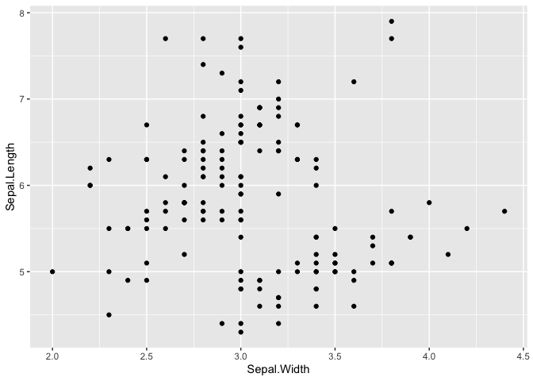

hw1
================
Mine Çetinkaya-Rundel
10/30/2019

This is needed for any chunk in the
    document.

``` r
library(tidyverse)
```

    ## ── Attaching packages ─────────────────────────────────────────── tidyverse 1.2.1 ──

    ## ✔ ggplot2 3.2.1     ✔ purrr   0.3.3
    ## ✔ tibble  2.1.3     ✔ dplyr   0.8.3
    ## ✔ tidyr   1.0.0     ✔ stringr 1.4.0
    ## ✔ readr   1.3.1     ✔ forcats 0.4.0

    ## ── Conflicts ────────────────────────────────────────────── tidyverse_conflicts() ──
    ## ✖ dplyr::filter() masks stats::filter()
    ## ✖ dplyr::lag()    masks stats::lag()

## Question 1

And here is some other code that is required for the next chunk:

``` r
iris_modified <- iris %>%
  mutate(
    sepal_ratio = Sepal.Width / Sepal.Length,
    petal_ratio = Petal.Width / Petal.Length
    )
```

And here is another problematic chunk, with an actual error. `s`pecies
should be
`S`pecies.

``` r
ggplot(iris_modified, aes(x = sepal_ratio, y = petal_ratio, color = species)) +
  geom_point()
```

    ## Error in FUN(X[[i]], ...): object 'species' not found

<!-- -->

## Question 2

Below is some code that has is not required to run the next chunk.

``` r
ggplot(iris, aes(x = Sepal.Width, y = Sepal.Length)) +
  geom_point()
```

<!-- -->

And here is the chunk in question. Should have used `summarise()` not
`mutate()` is the answer.

``` r
iris %>%
  group_by(Species) %>%
  mutate(mean_sw = mean(Sepal.Width))
```

    ## # A tibble: 150 x 6
    ## # Groups:   Species [3]
    ##    Sepal.Length Sepal.Width Petal.Length Petal.Width Species mean_sw
    ##           <dbl>       <dbl>        <dbl>       <dbl> <fct>     <dbl>
    ##  1          5.1         3.5          1.4         0.2 setosa     3.43
    ##  2          4.9         3            1.4         0.2 setosa     3.43
    ##  3          4.7         3.2          1.3         0.2 setosa     3.43
    ##  4          4.6         3.1          1.5         0.2 setosa     3.43
    ##  5          5           3.6          1.4         0.2 setosa     3.43
    ##  6          5.4         3.9          1.7         0.4 setosa     3.43
    ##  7          4.6         3.4          1.4         0.3 setosa     3.43
    ##  8          5           3.4          1.5         0.2 setosa     3.43
    ##  9          4.4         2.9          1.4         0.2 setosa     3.43
    ## 10          4.9         3.1          1.5         0.1 setosa     3.43
    ## # … with 140 more rows
